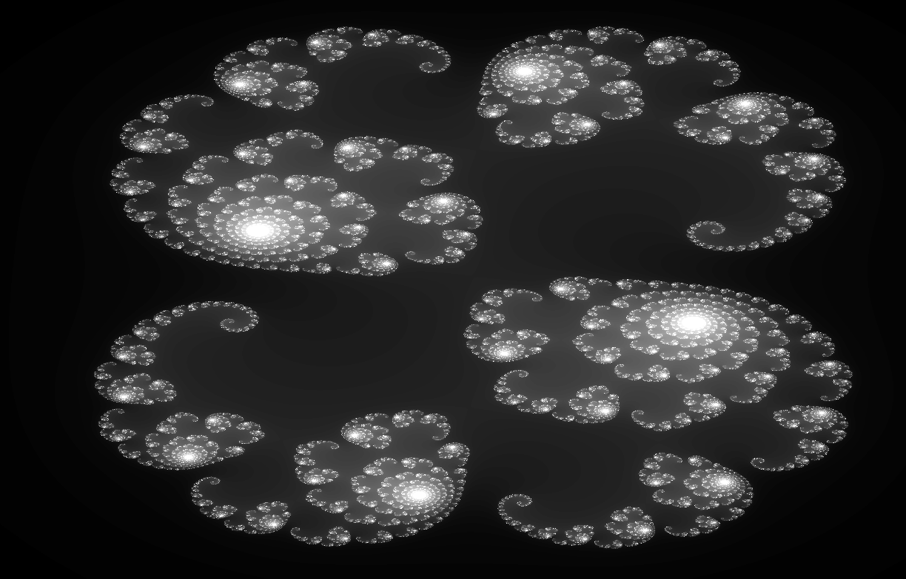

Julia2D
=======

Simple tool to visualize Julia fractals in 2D. This is based on OpenGL and Shaders. The fractal is computed on GPU using fragment Shader.

# Usage

```
cd src
make
./julia 0.285 -0.01
```

# Keyboard shortcuts

* `W`, `S` => Zoom in and out
* `A`, `D` => Left and Right
* `Z`, `X` => Up and Down
* `+`, `-` => Improve fractal details

# Example


